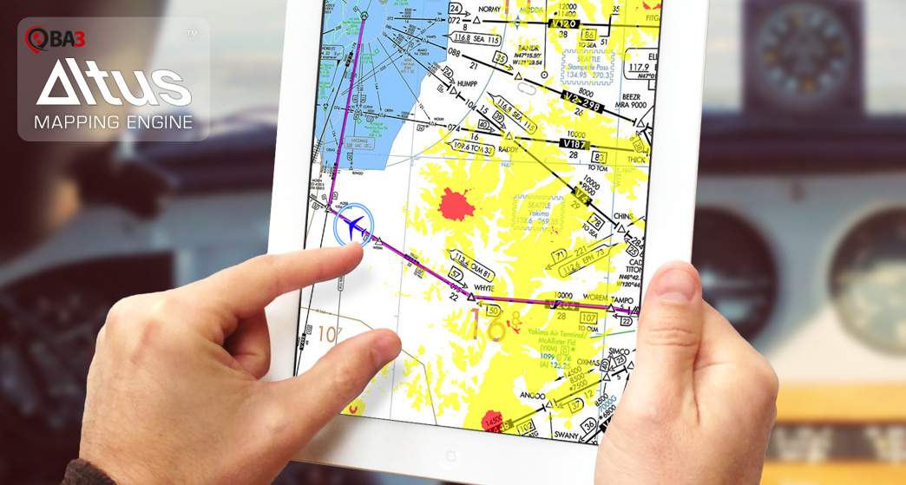

<b>BA3 Altus Mapping Engine SDK for iOS</b> 
The Altus Mapping Engine(TM) is a high-performance,  rendering
library designed for advanced GIS visualization. Altus has a proven track-record for complex, offline, cockpit use in general and commercial aviation. If you've hit the perfomance barries of other solutions, Altus may be for you.

Developers using SDKs like MapKit, Route-Me, and others generally run into performance,
capacity or feature walls that block development. The Altus Mapping Engine can eliminate those walls.

<b> July 4, 2015</b> 
Altus Releases are now available at <a href="http://builds.ba3.us/">builds.ba3.us</a>

<b> April 14, 2014</b> 
Today we have begun publishing our our ARC and ARM-64 branch out to GitHub. This release has several
notable changes:
<ul>
<li>Removed un-needed libs from the reference applications.</li>
<li>Moved the older non-ARC framework, tutorials, documentation and server tools to the deprecated folder.</li>
<li>Renamed our main include file name from ME.h to AltusMappingEngine.h</li>
<li>Released a new reference application called AltusDemo</li>
<li>Flattened the repository structure to a single branch, master, instead of per-branch tutorials as we had before</li>
</ul>

Older releases (prior to ARC-support) are now located in the 'deprecated' folder. Most of those
tutorials are still valuable so we'll keep them around for a while.

We have also recently announced a new web version that runs directly in your browser. You can learn more about that on our <a href="http://www.ba3.us">home page</a>.

<b>Get the BA3 Altus SDK and Sample Applications</b> 

Complete source code is supplied for all of the Altus Mapping Engine tutorials, 
and the tutorials themselves can be found in the 
<a href="http://www.ba3.us/?page=pages/knowledge-base">Knowledge Base</a>.
Tutorials documented there are located in the deprecated folder. Over time we'll bring these
up to date. Where the tutorials suggest checking out a branch, that is out of date. All tutorials
are now located in their own individual folders.

<pre>
git clone https://github.com/ba3llc/BA3MappingEngineTutorials.git
cd BA3MappingEngineTutorials
</pre>

You can learn more about the BA3 Altus Mapping Engine at <a href="http://ba3.us">BA3.us</a>. Questions? Please send them to info@ba3.us
